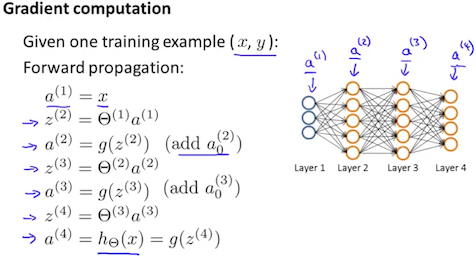

# Backpropogation algorithm

Backpropogation is a term used in neural network terminology for minimizing the cost function. The principle is that we calculate the error starting from our output layer (last layer in neural network) and check the difference with the hypothesis function to calculate the error or the delta.

The delta term is calculated against all activation nodes in each layer.

Back propogation algorithm:

- a1 = x1 First activation layer is the input.
- forward propogation to calculate al for l=2,3,....l

The following example shows forward propogation in a neural network with one training example.

- Using the value of y(t), (ie the output) we calculate δ(L) =a (L)−y (t). Where L is our total number of layers and a(L) is the vector of outputs of the activation units for the last layer. So our "error values" for the last layer are simply the differences of our actual results in the last layer and the correct outputs in y. To get the delta values of the layers before the last layer, we can use an equation that steps us back from right to left:

* δ(L-1),δ(L-2),δ(L-3)... δ(2) δ(l)=((Θ(l))Tδ(l+1)) .∗ a(l) .∗ (1−a(l))

The delta values of layer l are calculated by multiplying the delta values in the next layer with the theta matrix of layer l. We then **element-wise multiply that with a function called g', or g-prime, which is the derivative of the activation function g evaluated with the input values given by z(l)**

The g-prime derivative terms can also be written out as: g'(z(l)) a(l) .∗ (1−a(l))

- Δi,j(l) := Δi,j(l) ​ + aj(l)​ δi (l+1)
  > With vectorization this becomes Δ(l) := Δ(l) + δ(l+1)(a(l))T

Hence we update our new Δ matrix:

- D(l)i,j := 1 /m(Δi,j(l) +λΘ(l)i,j), if j≠0.
- D(l)i,j := 1 /m(Δi,j(l) If j=0

The capital-delta matrix D is used as an "accumulator" to add up our values as we go along and eventually compute our partial derivative. Thus we get `∂/∂Θ(l)ij J(Θ)= Dij(l)`
​
Here is the algorithm summarized in a picture:

