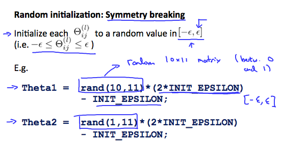

# Random initialization

> If, like logistic regression we calculate the value of each layer in a neural network by initialising the theta matrix of all zeros , we will get the value of the nodes in the layer as equal. After forward and back propogating the same, we get the values of delta to be the same as well, and thus the derivative ( or gradient at each iteration is miscalculated with the same values). To prevent this, we use random initialization.

Matlab implementation:

```matlab

% If the dimensions of Theta1 is 10x11, Theta2 is 10x11 and Theta3 is 1x11.
% rand(10,11) * (2 * INIT_EPSILON) - INIT_EPSILON gives the value of each unit in theta
% between -EPSILON and EPSILON
% rand(x,y) is just a function in matlab that will initialize a matrix of random real numbers between 0 and 1.
Theta1 = rand(10,11) * (2 * INIT_EPSILON) - INIT_EPSILON;
Theta2 = rand(10,11) * (2 * INIT_EPSILON) - INIT_EPSILON;
Theta3 = rand(1,11) * (2 * INIT_EPSILON) - INIT_EPSILON;


```

This is also known as **Symmetry breaking in a neural network and can be understood from the image below**

> Note, randomly initializing to same value in all theta ALSO wont break symmetry, due to the explanation above.


