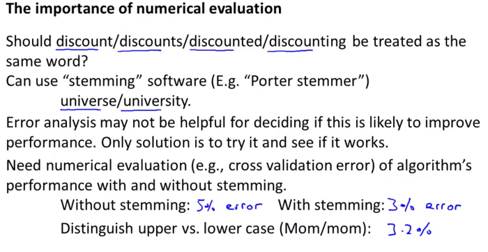

# Error Analysis

While designing a learning algorithm, a recommended approach can be:

- Implement a quick and dirty version of the learning algorithm ( **WITHOUT** spending too much time on it) , say for example 24 hours. Test this implementation on **CV** data.
- Plot learning curves on this to decide between high variance / high bias issues, whether to get more examples, add more features etc.
- Manually examine the examples that your algorithm reports errors on ( in CV set). This can be used as a huge benifit for getting an intuition into what examples are failing for the training our classifier, and what is causing the failure.

> For example, assume that we **have 500 emails** and our **algorithm misclassifies a 100** of them. We could manually analyze the 100 emails and categorize them based on what type of emails they are. We could then try to come up with new cues and features that would help us classify these 100 emails correctly. Hence, if most of our misclassified emails are those which **try to steal passwords**, then we could **find some features that are particular to those emails** (eg, more amount of punctuations, words misspelled, unusual routing in header etc) and add them to our model. We could also see how classifying each word according to its root changes our error rate

Very often, different classification problems have SIMILAR set of problems /examples that they fail to classify upon, if identified, appropriate features can be used to understand and represent the same. This can thus, be very useful.

## Importance of numerical evaluation:

Evaluating our algorithm based on a single real number can be really helpful, to quickly test different ideas and algorithms on our training sets, and see if the numerical evaluation changes

This could be accuracy percentage error percentage etc.

The following image gives an example of the same:

> In the above example, if we use stemming, which is the process of treating the same word with different forms (fail/failing/failed) as one word (fail), and get a 3% error rate instead of 5%, then we should definitely add it to our model. However, if we try to distinguish between upper case and lower case letters and end up getting a 3.2% error rate instead of 3%, then we should avoid using this new feature. Hence, we should try new things, get a numerical value for our error rate, and based on our result decide whether we want to keep the new feature or not.

[Further reading on Error analysis](https://www.coursera.org/learn/machine-learning/supplement/Z11RP/error-analysis)
