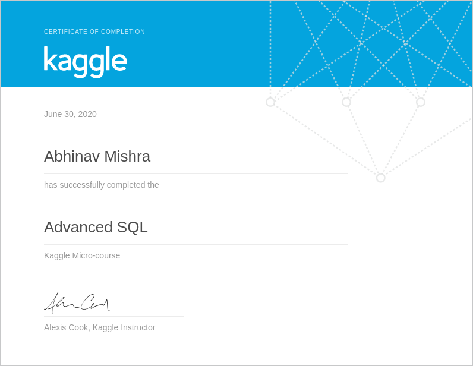

# Completion Summary

> [Advanced SQL mini course](https://www.kaggle.com/learn/advanced-sql)
 
* [Joins and UNIONS](https://www.kaggle.com/alexisbcook/joins-and-unions) -> Completed on 28-06-2020
* [Analytic functions](https://www.kaggle.com/alexisbcook/analytic-functions) -> Completed on 29-06-2020
* [Nested and repeated data](https://www.kaggle.com/alexisbcook/nested-and-repeated-data) -> Completed on 30-06-2020
* [Writing Efficient queries](https://www.kaggle.com/alexisbcook/writing-efficient-queries) -> Completed on 30-06-2020

