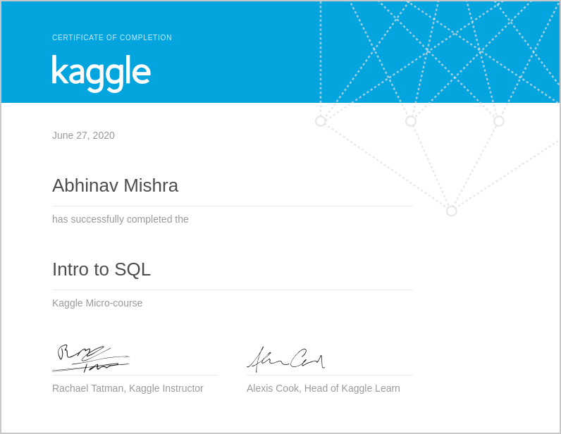

# Completion Summary

> [Intro to SQL mini course](https://www.kaggle.com/learn/intro-to-sql)
 
* [Getting started with SQL and bigquery](https://www.kaggle.com/dansbecker/getting-started-with-sql-and-bigquery) - Completed on 26-06-2020
* [Select From and Where ](https://www.kaggle.com/dansbecker/select-from-where) - Completed on 26-06-2020
* [Group By, Having and Count](https://www.kaggle.com/dansbecker/group-by-having-count) - Completed on 26-06-2020
* [Order By](https://www.kaggle.com/dansbecker/order-by) - Completed on 27-06-2020
* [As and With](https://www.kaggle.com/dansbecker/as-with) - Completed on 27-06-2020
* [Joins](https://www.kaggle.com/dansbecker/joining-data) - Completed on 27-06-2020

